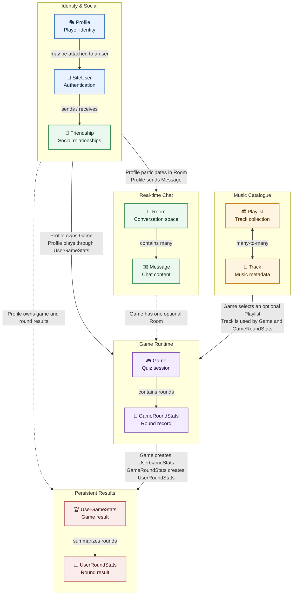

_This project has been created as part of the 42 curriculum by hcavet, vviterbo, fmixtur, kgauthie, yisho._

# ft_transcendence: Guess Tunes

## Description

### Project

Guess Tunes is a full-stack multiplayer web application built for the final project of the 42 Common Core. The application is centered around a real-time music quiz "blindtest" game where players join rooms, listen to track previews, guess the artist and title, compare scores, and build persistent profile progression.

The project combines a React single-page frontend, a Django backend, a PostgreSQL database, WebSocket communication, HTTPS deployment through nginx, user accounts, profiles, friends, chat, notifications, localization, statistics, and game customization settings.

### Key Features

- User registration, login, logout, refresh-token authentication, and protected routes.
- Guest profiles and authenticated user profiles.
- Profile pages with avatar upload, username update, statistics, titles, match history, and progression.
- Friend requests, friends list, online status, and user discovery.
- Direct messages and in-game chat.
- Real-time WebSocket updates for social events, notifications, chat, and game state.
- Multiplayer music quiz rooms with public, friends-only, and private visibility.
- Game settings for genres, number of tracks, round duration, break duration, scoring mode, answer visibility, and fuzzy matching.
- Six music genres: pop, rock, rap, electro, French pop, and R&B.
- Persistent game statistics, leaderboards, XP, levels, titles, and match history.
- Automatic cleanup of abandoned lobbies and stale active games through Celery and Redis.
- Frontend localization in English, French, Japanese, and German.
- Static Terms of Service, Privacy Policy, Contact, and Q&A pages.
- Dockerized deployment with nginx serving the frontend, static files, media files, API, and WebSocket proxy.

## Instructions

### Prerequisites

The project is intended to run through Docker.

Required tools:

- Docker with Docker Compose support.
- GNU Make.
- OpenSSL, used by the Makefile to generate the local self-signed HTTPS certificate.
- A modern browser. The mandatory target browser is the latest stable Google Chrome.

The application containers provide their own runtime dependencies:

- Frontend: Node.js 20, React 19, TypeScript, Vite, Material UI.
- Backend: Python 3.14, Django 6, Django REST Framework, Django Channels, Daphne.
- Database: PostgreSQL 17, stored in the `database-data` Docker volume.
- Background services: Redis 7, Celery worker, and Celery beat.
- Web server: nginx.

### Environment Setup

The build/start workflow synchronizes music metadata from external sources, so Docker must have internet access. Then follow these steps from the repository root:

1. Create the services environment file from the example:

```bash
cp services/.env.example services/.env
```

2. Edit `services/.env` and replace the placeholder secrets:

```env
SECRET_KEY=<replace-with-a-secret-value>
POSTGRES_DB=transcendence
POSTGRES_USER=transcendence
POSTGRES_PASSWORD=<replace-with-a-database-password>
POSTGRES_HOST=database
POSTGRES_PORT=5432
DEBUG=False
ALLOWED_HOSTS=localhost,127.0.0.1,backend
CSRF_TRUSTED_ORIGINS=https://localhost:4443
```

`SECRET_KEY` and `POSTGRES_PASSWORD` must not retain their example values. The local `.env` file must not be committed.

3. Build and run from a clean state:

```bash
make fresh
```

This command:

- removes previous local containers, volumes, images, and generated local TLS certificates;
- creates required runtime directories;
- builds the backend and nginx/frontend Docker images;
- generates a local self-signed TLS certificate;
- runs database migrations;
- seeds demo data and playlists;
- starts the database, Redis, backend, Celery worker, Celery beat, and nginx containers.

4. Wait until the containers are healthy (`make status`), then open:

```text
https://localhost:4443
```

The browser will show a certificate warning because the certificate is self-signed for local development. Accept it only for this local `localhost` deployment.

5. Use `make logs` if startup or playlist synchronization fails. Press `Ctrl-C` to stop following logs without stopping the containers.

### Normal Restart

After the first setup:

```bash
make run
```

This rebuilds and starts the application without deleting the database volume.

### Useful Commands

| Command                  | Purpose                                                           |
| ------------------------ | ----------------------------------------------------------------- |
| `make help`              | Show available Makefile commands.                                 |
| `make fresh`             | Full clean rebuild with fresh database and generated certificate. |
| `make run`               | Build and start the application while preserving volumes.         |
| `make down`              | Stop and remove containers.                                       |
| `make stop`              | Stop containers without removing them.                            |
| `make start`             | Start stopped containers.                                         |
| `make logs`              | Follow container logs.                                            |
| `make status`            | Show container status.                                            |
| `make clean`             | Remove containers and networks while preserving volumes/images.   |
| `make fclean`            | Remove containers, volumes, images, and generated TLS files.      |
| `make prepare-db`        | Apply migrations and prepare a fresh seeded database.             |
| `make prepare-playlists` | Migrate and synchronize playlist data without demo seeding.       |
| `make delete-migrations` | Delete numbered Django migration files; use only when rebuilding. |
| `make backend-test`      | Run the Makefile's selected backend profile test in a container.  |

Frontend development commands are available from `services/frontend`:

```bash
npm install
npm run dev
npm run build
npm run lint
npm test -- --run
```

## Team Information

| 42 login | Name                | Assigned role(s)           |
| -------- | ------------------- | -------------------------- |
| hcavet   | Hugo Cavet          | Product Owner, Developer   |
| vviterbo | Victor Viterbo      | Tech Lead, Developer       |
| fmixtur  | Fabien Mixtur       | Project Manager, Developer |
| kgauthie | Kristopher Gauthier | Developer                  |
| yisho    | Yishan Ho           | Developer                  |

### Responsibilities

- **hcavet (Product Owner, Developer)** - Defined product scope and feature priorities. Frontend: implemented authentication, user management, stats, footer pages and documentation. Infra: configured Makefile, Docker and Nginx.
- **vviterbo (Tech Lead, Developer)** - Coordinated architecture and technical decisions. Backend: implemented authentication, WebSocket, user management, stats and game.
- **fmixtur (Project Manager, Developer)** - Facilitated team coordination and organized meetings. Backend: implemented music module and game.
- **kgauthie (Developer)** - Frontend: implemented WebSocket, game, mocks, tests, social features, localization and styling.
- **yisho (Developer)** - Backend: implemented social features and notifications.

## Project Management

### Organization

The team distributed tasks based on each member's preferences, strengths, and learning goals. Some members were already more comfortable with frontend work, while others focused on backend features or had to spend time learning Python and Django before contributing fully to the implementation.

We tried to organize regular meetings to discuss progress, blockers, and integration work. However, because team members did not all have the same availability, it was difficult to maintain a strict sprint-planning process. Instead, the organization stayed flexible: tasks were assigned and adjusted progressively depending on availability, project priorities, and the areas each member was most comfortable taking ownership of.

Tasks were split by feature ownership and reviewed during integration. Branches and pull requests were used to isolate work before merging.

### Tools

- Git and GitHub for version control and code review.
- Notion for task tracking.
- Discord server with categorized channels and a webhook linked to the GitHub repository to receive updates and changes as notifications.
- Google Docs for TODO lists and bug reports.

## Technical Stack

### Frontend

- React 19 for the single-page application.
- TypeScript for typed frontend code.
- Vite for development and production builds.
- React Router for client-side routing.
- Material UI and Emotion for UI components and styling.
- Axios for HTTP API calls.
- `react-use-websocket` for WebSocket lifecycle handling.
- Vitest, Testing Library, MSW, and jsdom for frontend tests and mocks.

React was chosen because it is well suited to stateful interfaces with reusable components, live game state, protected routes, forms, and profile/social pages.

### Backend

- Django 6 for the backend application.
- Django REST Framework for HTTP API endpoints.
- Django Channels and Daphne for ASGI and WebSocket support.
- Simple JWT for access and refresh token authentication.
- Django ORM for database models and migrations.
- Pillow for avatar image validation and processing.
- RapidFuzz / TheFuzz / Levenshtein for fuzzy answer matching in the music quiz.

Django was chosen because it provides a strong ORM, authentication foundation, migrations, structured apps, admin support, and a stable base for combining REST APIs with WebSockets.

### Database

- PostgreSQL is used as the project database.
- PostgreSQL stores its data in the `database-data` Docker volume at `/var/lib/postgresql/data`.
- The database is reachable only from the private Docker Compose network; no database port is published to the host.

PostgreSQL was chosen for its transactional integrity, foreign-key and uniqueness constraints, mature Django support, native `uuid` and `jsonb` types, and suitability for persistent relational data such as friendships, game participation, round results, and message history.

### Deployment and Infrastructure

- Docker Compose runs PostgreSQL, Redis, the Daphne backend, a Celery worker, Celery beat, and nginx.
- The worker executes asynchronous jobs while beat schedules periodic jobs. The game reaper runs every minute.
- Redis provides the Channels cross-process layer and the Celery broker/result backend.
- nginx serves the built frontend, Django static files, uploaded media, REST API proxying, and WebSocket proxying.
- HTTPS is enabled locally with a self-signed certificate generated by the Makefile. HTTP redirects to HTTPS.
- Static assets and collected Django static files are built into the nginx image; uploaded media is stored in the `backend-media` volume.
- Docker volumes persist PostgreSQL data and uploaded media. The database and Redis ports are not published to the host.

### Runtime Cleanup

Celery beat schedules `reap_foresaken_waiting_games` every minute. The task:

- Deletes waiting games whose lobby has exceeded the configured timeout.
- Deletes aborted games and their temporary room and playlist data.
- Tracks `Game.last_activity_at` when the live game loop emits lifecycle events.
- Marks active games with stale activity as aborted and sends an abort event through Redis so a live Daphne game loop can stop.

Finished games remain available for statistics and match history. The current timeout values are defined in `services/backend/project/defaults.py`.

## Database Schema

The backend uses **PostgreSQL** with Django ORM. UUID fields are the public identifiers used by the API; Django's internal numeric primary keys remain database implementation details. `Track` is the exception: its iTunes identifier is the primary key and is stored as a PostgreSQL `bigint`.

### Relationship Diagram



The category-level arrows keep the overview readable; the tables and relationship notes below document the exact model-level foreign keys and through tables. Django creates an internal `bigint` primary key named `id` for every model below except `Track`. Foreign keys store that primary key; public API references use the separate unique `uuid` fields where exposed.

### Tables, Key Fields, and Data Types

The types below are their PostgreSQL representations. `timestamptz` is PostgreSQL `timestamp with time zone`.

#### Identity and Social

| Table                               | Purpose                                                   | Key fields and PostgreSQL types                                                                                                                                                                                                                                                                                                                                      |
| ----------------------------------- | --------------------------------------------------------- | -------------------------------------------------------------------------------------------------------------------------------------------------------------------------------------------------------------------------------------------------------------------------------------------------------------------------------------------------------------------- |
| `userauth_siteuser` (`SiteUser`)    | Authentication account; email is the login identifier.    | `id bigint PK`; `uid uuid UNIQUE`; `email varchar(254) UNIQUE NOT NULL`; `password varchar(128)` (Django password hash); `is_active`, `is_staff`, `is_superuser boolean`; `last_login timestamptz NULL`; `date_joined timestamptz`. The inherited Django auth model also stores `first_name` and `last_name` as `varchar(150)` and has group/permission join tables. |
| `userprofile_profile` (`Profile`)   | Public identity for a registered user or anonymous guest. | `id bigint PK`; `uid uuid UNIQUE`; `user_id bigint UNIQUE NULL FK → SiteUser`; `username varchar(20)` with conditional uniqueness except `Anonymous`; `avatar varchar(100) NULL` (media path); `exp_points integer`; `session_key varchar(40) NULL INDEX`; `guest`, `is_online boolean`; `active_ws_connections integer`; `created_at`, `last_active timestamptz`.   |
| `friends_friendship` (`Friendship`) | Directional pending request or accepted friendship.       | `id bigint PK`; `uid uuid UNIQUE`; `from_user_id bigint FK → SiteUser`; `to_user_id bigint FK → SiteUser`; `status varchar(20)` (`pending` or `accepted`); `read boolean`; `created_at timestamptz`; `UNIQUE(from_user_id, to_user_id)`.                                                                                                                             |

#### Chat

| Table                      | Purpose                                            | Key fields and PostgreSQL types                                                                                                                                                                                 |
| -------------------------- | -------------------------------------------------- | --------------------------------------------------------------------------------------------------------------------------------------------------------------------------------------------------------------- |
| `chat_room` (`Room`)       | Game/group chat or one-to-one direct-message room. | `id bigint PK`; `uid uuid UNIQUE`; `name varchar(100) UNIQUE`; `is_direct boolean`; `direct_key varchar(64) UNIQUE NULL`. Participants are stored in the implicit room/profile join table.                      |
| `chat_message` (`Message`) | Persisted room message and delivery state.         | `id bigint PK`; `uid uuid UNIQUE`; `sender_id bigint FK → Profile`; `room_id bigint FK → Room`; `body text` (application limit: 500 characters); `delivered`, `seen boolean`; `created`, `updated timestamptz`. |

#### Music Catalogue

| Table                         | Purpose                              | Key fields and PostgreSQL types                                                                                                                                                            |
| ----------------------------- | ------------------------------------ | ------------------------------------------------------------------------------------------------------------------------------------------------------------------------------------------ |
| `music_playlist` (`Playlist`) | Imported playlist or genre grouping. | `id bigint PK`; `uid uuid UNIQUE`; `name varchar(255) UNIQUE`; `rss_url varchar(500)`.                                                                                                     |
| `music_track` (`Track`)       | Reusable iTunes track metadata.      | `itunes_id bigint PK`; `title`, `artist varchar(255)`; `genre varchar(100) NULL`; `preview_url`, `artwork_url varchar(500) NULL`. Playlist membership is stored in an implicit join table. |

#### Games and Statistics

| Table                                     | Purpose                                                                           | Key fields and PostgreSQL types                                                                                                                                                                                                                                                                                                                                                                                                                                                                                                                                                                                                                                                |
| ----------------------------------------- | --------------------------------------------------------------------------------- | ------------------------------------------------------------------------------------------------------------------------------------------------------------------------------------------------------------------------------------------------------------------------------------------------------------------------------------------------------------------------------------------------------------------------------------------------------------------------------------------------------------------------------------------------------------------------------------------------------------------------------------------------------------------------------ |
| `game_game` (`Game`)                      | Multiplayer quiz settings and runtime state.                                      | `id bigint PK`; `uid uuid UNIQUE INDEX`; `name varchar(40)`; `genres jsonb`; `status varchar(20)` (`waiting`, `playing_round`, `playing_break`, `finished`, `aborted`); `visibility varchar(20)` (`public`, `friends`, `private`); `mode varchar(20)` (`normal`, `speed`); `playbackDuration`, `breakDuration double precision NULL`; `trackCount`, `current_round integer`; `fuzzy`, `reveal boolean`; `created_at`, `last_activity_at timestamptz NULL`; `started_at timestamptz NULL`; `owned_by_id bigint NULL FK → Profile`; `room_id bigint UNIQUE NULL FK → Room`; `playlist_id bigint UNIQUE NULL FK → Playlist`; `current_track_id bigint NULL FK → Track.itunes_id`. |
| `stats_gameroundstats` (`GameRoundStats`) | One round within a game.                                                          | `id bigint PK`; `round_number integer`; `game_id bigint FK → Game`; `track_id bigint NULL FK → Track.itunes_id`. Player participation is represented by `UserRoundStats`.                                                                                                                                                                                                                                                                                                                                                                                                                                                                                                      |
| `stats_usergamestats` (`UserGameStats`)   | One player's aggregate participation in one game; also implements `Game.players`. | `id bigint PK`; `game_id bigint FK → Game`; `player_id bigint FK → Profile`; `is_won`, `is_active boolean`; `played_at timestamptz`; `UNIQUE(game_id, player_id)`. Total XP is computed from round rows rather than stored here.                                                                                                                                                                                                                                                                                                                                                                                                                                               |
| `stats_userroundstats` (`UserRoundStats`) | One player's result for one round.                                                | `id bigint PK`; `game_stats_id bigint NULL FK → UserGameStats`; `round_id bigint FK → GameRoundStats`; `player_id bigint FK → Profile`; `time`, `artist_found_at`, `title_found_at double precision`; `artist_found`, `title_found boolean`; `xp_earned`, `ranking integer`; `played_at timestamptz`.                                                                                                                                                                                                                                                                                                                                                                          |

### Join Tables

Django materializes ordinary many-to-many relations as junction tables with two foreign keys and a uniqueness constraint on the pair:

| Relationship                       | Storage                                                                                                  |
| ---------------------------------- | -------------------------------------------------------------------------------------------------------- |
| `Room.participants ↔ Profile`      | Implicit `chat_room_participants` table (`room_id bigint`, `profile_id bigint`).                         |
| `Playlist.tracks ↔ Track`          | Implicit `music_track_playlists` table (`track_id bigint`, `playlist_id bigint`).                        |
| `Game.players ↔ Profile`           | Explicit `stats_usergamestats` through table, which also stores win/active state and play time.          |
| `GameRoundStats.players ↔ Profile` | Explicit `stats_userroundstats` through table, which stores answer timing, correctness, XP, and ranking. |

### Relationship Notes

- A `SiteUser` can have one `Profile`; guest profiles have no attached account.
- `Friendship` belongs to `SiteUser`, while rooms, messages, games, and statistics belong to `Profile`.
- `Room` and `Message` power chat. Direct rooms use `is_direct` and `direct_key` to identify one-to-one conversations.
- `Game` connects the social and music domains through an optional room, one playlist, an optional current track, and an owning profile.
- `Game.players` is represented by the `UserGameStats` join model. Round participation is represented by `UserRoundStats`, which connects a profile to a `GameRoundStats` record and optionally to its game summary.
- `Playlist` and `Track` are many-to-many, so imported tracks can be reused across playlists without duplicating metadata.
- Avatars are stored as file paths in `Profile.avatar`; the image files themselves live in the persistent media volume, not in PostgreSQL.

## Features List

| Feature                    | Description                                                                                                                                                                                    | Team member(s)                      |
| -------------------------- | ---------------------------------------------------------------------------------------------------------------------------------------------------------------------------------------------- | ----------------------------------- |
| Authentication             | Registration, login, logout, protected routes, refresh cookie, JWT access token flow.                                                                                                          | hcavet, vviterbo                    |
| Guest profile support      | Allows non-authenticated users to use a guest profile before login.                                                                                                                            | vviterbo                            |
| Profile management         | Public profile, personal profile, username update, avatar upload, default avatars.                                                                                                             | hcavet, vviterbo                    |
| Friends system             | Friend requests, acceptance, friends list, online status, profile relationship actions.                                                                                                        | kgauthie, yisho                     |
| Direct chat                | Private rooms, persisted messages, delivered/seen state, real-time delivery.                                                                                                                   | kgauthie, yisho                     |
| Notifications              | App notifications for social events such as friend requests and accepted requests.                                                                                                             | kgauthie, yisho                     |
| Game room list             | Create, browse, and join public/friends/private music quiz rooms.                                                                                                                              | hcavet, vviterbo, fmixtur, kgauthie |
| Game customization         | Host settings for genres, track count, round timing, break timing, visibility, reveal mode, fuzzy matching, and score mode.                                                                    | vviterbo, fmixtur, kgauthie         |
| Multiplayer music quiz     | Real-time game rounds where players guess title and artist from audio previews.                                                                                                                | vviterbo, fmixtur, kgauthie         |
| In-game chat               | Game-room chat synchronized through WebSockets.                                                                                                                                                | kgauthie, yisho                     |
| Leaderboard                | Global ranking based on persistent user progression and game results.                                                                                                                          | hcavet, vviterbo                    |
| Statistics and history     | Profile statistics, match history, round details, XP, levels, and titles.                                                                                                                      | hcavet, vviterbo                    |
| Localization               | English, French, Japanese, and German localization with a language selector.                                                                                                                   | hcavet, kgauthie                    |
| Responsive UI system       | Shared layout, text, navigation, image, feedback, and surface components.                                                                                                                      | kgauthie                            |
| Custom design system       | Shared theme, color palette, typography rules, reusable layout components, navigation components, form components, profile/avatar components, feedback components, and game-specific surfaces. | kgauthie                            |
| Music data synchronization | Backend commands fetch and synchronize playlist/track data from external music sources, store track metadata and preview URLs, and make the data available to game rooms by genre.             | fmixtur                             |
| Docker deployment          | Containerized backend and nginx/frontend deployment with HTTPS.                                                                                                                                | hcavet                              |
| Tests and mocks            | Frontend tests, backend tests, mock API handlers, and validation-oriented checks.                                                                                                              | everyone                            |

## Game Rules and Settings

### Rules

- A player creates or joins a game room.
- The host can configure the game before it starts.
- Each round plays a music preview.
- Players submit guesses for the track title and artist.
- Correct answers award points and XP.
- In speed mode, faster correct answers are worth more.
- At the end of the configured number of tracks, the game finishes and results are saved.
- Player results contribute to profile statistics, match history, leaderboard position, XP, levels, and titles.

### Settings

| Setting            | Description                                                                                          |
| ------------------ | ---------------------------------------------------------------------------------------------------- |
| Genres             | Selects which music categories can appear in the game: pop, rock, rap, electro, French pop, and R&B. |
| Visibility         | Controls who can find or join a room: public, friends-only, or private.                              |
| Track count        | Number of tracks/rounds in the game.                                                                 |
| Round duration     | Time available to answer during each music preview.                                                  |
| Break duration     | Time between rounds.                                                                                 |
| Score mode         | Normal mode or speed mode.                                                                           |
| Answers visibility | Controls whether answers are revealed to players.                                                    |
| Fuzzy matching     | Allows approximate artist/title answers so small typos can still be accepted.                        |

## Modules

Total claimed points: **21**: six Major modules × 2 points = 12 points, plus nine Minor modules × 1 point = 9 points.

| Module                                      | Type  | Points | Implementation                                                                                                                     | Team member(s)                    |
| ------------------------------------------- | ----- | -----: | ---------------------------------------------------------------------------------------------------------------------------------- | --------------------------------- |
| Use a frontend framework                    | Minor |      1 | React, TypeScript, Vite, React Router, component-based SPA.                                                                        | hcavet, kgauthie                  |
| Use a backend framework                     | Minor |      1 | Django, Django REST Framework, Django Channels, structured Django apps.                                                            | vviterbo, fmixtur, yisho          |
| Real-time features using WebSockets         | Major |      2 | WebSocket consumer for game events, chat, notifications, online state, and synchronized room updates.                              | everyone                          |
| Allow users to interact with other users    | Major |      2 | Profiles, friends, friend requests, direct chat, in-game chat, social profile actions.                                             | hcavet, vviterbo, kgauthie, yisho |
| Use an ORM for the database                 | Minor |      1 | Django ORM models, relationships, migrations, validators, and query APIs.                                                          | vviterbo, fmixtur, yisho          |
| Custom-made design system                   | Minor |      1 | Shared components for layout, navigation, text, images, feedback, surfaces, forms, and theme styling.                              | kgauthie                          |
| Support for multiple languages              | Minor |      1 | Localization CSV with English, French, Japanese, and German plus language switching.                                               | hcavet, kgauthie                  |
| Standard user management and authentication | Major |      2 | Account creation, login/logout, refresh token cookie, profile update, avatar upload, friends, online status.                       | hcavet, vviterbo                  |
| Game statistics and match history           | Minor |      1 | Persistent per-game and per-round stats, profile statistics panels, match history, leaderboard, XP.                                | hcavet, vviterbo                  |
| Complete web-based game                     | Major |      2 | Multiplayer music quiz with clear rounds, scoring, win/loss/result state, and persistent game results.                             | vviterbo, kgauthie, fmixtur       |
| Remote players                              | Major |      2 | Separate clients can join the same room and receive synchronized real-time gameplay over WebSockets.                               | everyone                          |
| Multiplayer game with more than two players | Major |      2 | Game rooms support more than two simultaneous players with shared leaderboard and synchronized state.                              | everyone                          |
| Game customization options                  | Minor |      1 | Host-configurable genres, visibility, track count, round duration, break duration, score mode, reveal answers, and fuzzy matching. | vviterbo, kgauthie, fmixtur       |
| Gamification system                         | Minor |      1 | Persistent XP, levels/progress, titles, leaderboard, match history, and profile progression feedback.                              | hcavet, vviterbo                  |
| Support for additional browsers             | Minor |      1 | Compatibility with Firefox and Brave                                                                                               | everyone                          |

### Module Choice Rationale

- **Frontend framework, backend framework, and ORM:** React and Django split the live interface from the authoritative server while keeping each side structured and testable. Django ORM provides migrations, constraints, and relational queries for the project's strongly connected data.
- **WebSockets and remote multiplayer:** the quiz, chat, presence, notifications, settings, and round transitions must reach separate browser clients in real time; request/response HTTP alone would not provide the required synchronization.
- **User interaction and standard user management:** persistent identities, profiles, friendships, and private communication turn the game into a social application rather than an isolated match screen.
- **Complete game, more-than-two-player multiplayer, customization, statistics, and gamification:** these modules form the core product loop: configure a room, play synchronized rounds, compare results, retain history, and progress a profile over multiple sessions.
- **Multiple languages and additional browsers:** localization and Firefox/Brave compatibility broaden access beyond the mandatory English/Chrome baseline and exercise the shared UI architecture.
- **Custom-made design system (custom module of choice):** the application has many repeated surfaces—forms, dialogs, navigation, game panels, profile cards, feedback states, and responsive layouts. A shared Material UI-based component and theme layer was chosen to keep behavior and visual language consistent instead of styling every page independently.

The implementation column above identifies how each module appears in the project, while the team column records its primary contributors. Detailed work ownership is expanded in [Individual Contributions](#individual-contributions).

## Browser Compatibility

The mandatory browser target is the latest stable Google Chrome. The additional browser compatibility module covers Firefox and Brave.

Detailed compatibility notes and code-review findings are documented in [BROWSER_COMPATIBILITY.md](BROWSER_COMPATIBILITY.md).

## Individual Contributions

### hcavet / Hugo Cavet

Hugo worked mainly on frontend architecture, authentication integration, profile/statistics pages, API contract alignment, deployment tooling, and evaluation preparation.

Main areas:

- React/Vite frontend structure and shared frontend architecture.
- Authentication provider logic, protected routes, login/register flows, token refresh handling, and frontend auth tests/mocks.
- Profile pages, profile editing, avatar handling, validation helpers, leaderboard UI, statistics panels, and match history panels.
- Localization support across auth, profile, and static pages, with frontend API contracts kept aligned with backend changes.
- Static pages including Q&A, Contact, Terms of Service, and Privacy Policy.
- Docker, nginx, HTTPS, Makefile deployment commands, health checks, and evaluation documentation.

**Challenge and resolution:** keeping authentication state consistent across protected routes, refresh-token rotation, API failures, and multiple tabs required more than page-local state. Hugo centralized this behavior in the authentication provider and API client/interceptors, then covered the flows with focused frontend tests and mocks.

### vviterbo / Victor Viterbo

Victor worked mainly on backend architecture, authentication, profile/user modeling, database structure, statistics, WebSocket integration, and backend tests.

Main areas:

- Django backend structure and technical architecture.
- Custom user/profile split, JWT authentication, refresh-token rotation, logout behavior, and related tests.
- Profile update, password update, deletion, avatar/default-avatar, and guest/authenticated profile behavior.
- Database models and relations for users, profiles, friends, games, and statistics.
- Statistics and leaderboard backend endpoints.
- Game backend foundations, WebSocket event handling, database seeding, migrations, environment files, and backend test coverage.

**Challenge and resolution:** registered users and anonymous guests need the same profile-facing game interface while having different authentication and lifecycle rules. Victor separated account data from the nullable-user `Profile`, integrated profile resolution into HTTP/WebSocket handling, and used migrations and lifecycle tests to protect the model transitions.

### fmixtur / Fabien Mixtur

Fabien worked mainly on the music data module and the backend side of the game: game creation, game settings, answer validation, scoring, WebSocket game events, and game lifecycle behavior.

Main areas:

- Music module with playlist and track models.
- External music data synchronization, playlist seeding, track metadata, artwork, and audio preview handling.
- Game creation APIs, serializers, settings support, genre handling, and game UID based payloads.
- Backend game logic for rounds, answer validation, fuzzy matching, scoring, ranking, and game-end results.
- WebSocket game events such as settings updates, game start, round preview, answer broadcast, round end, game end, errors, and restart behavior.
- Backend tests around game creation, playlist generation, and game event behavior.

**Challenge and resolution:** external music metadata is not guaranteed to be complete or immediately suitable for a timed quiz, while answers may contain spelling differences. Fabien implemented repeatable playlist synchronization and filtering, persisted reusable track metadata, and combined normalized title/artist comparison with fuzzy-matching libraries in the scoring flow.

### kgauthie / Kristopher Gauthier

Kristopher worked mainly on the frontend design system, UI/UX, social screens, notification screens, game frontend, WebSocket UI integration, localization, and responsive layout cleanup.

Main areas:

- Reusable Material UI based components, layout components, typography components, navigation pieces, forms, drawers, and shared styling.
- Home page room creation, room joining, room listing, and related responsive behavior.
- Social frontend flows: friends list, friend requests, friend search/add, direct chat UI, social drawer, and notification drawer.
- Game frontend screens: lobby, settings, game chat, in-game leaderboard, round view, end view, answer feedback, point display, and game error/loading states.
- WebSocket-driven UI behavior and mock handlers for game/social flows.
- Mobile compatibility across home, profile, social, leaderboard, and game pages, including German text layout.

**Challenge and resolution:** live game/social events, responsive layouts, and longer translated strings can cause inconsistent state and visual regressions across many screens. Kristopher concentrated event handling in shared game/WebSocket structures, built reusable responsive components, and exercised the flows with Vitest, Testing Library, and MSW handlers.

### yisho / Yishan Ho

Yishan worked mainly on backend social features, direct chat, game chat integration, WebSocket notifications, presence/online behavior, and friend-related backend adjustments.

Main areas:

- Private chat and direct-message behavior between users.
- Chat rooms, message persistence, delivery/seen behavior, and direct recipient lookup.
- WebSocket notification behavior for friend requests and social events.
- Chat integration inside game rooms, with game-chat payloads shaped for the frontend event format.
- Friend/social backend behavior, including remove-friend support and frontend-compatible response shapes.
- Chat and social tests aligned with WebSocket and payload protocol changes.

**Challenge and resolution:** direct-message delivery and read state must remain coherent when either user is offline, has several WebSocket connections, or opens/closes a conversation. Yishan combined persisted `delivered`/`seen` flags with active-connection counting, chat-open state, recipient-specific events, and backend chat/social tests.

## Resources

### Documentation and Technical References

- 42 subject: [docs/en.subject.pdf](docs/en.subject.pdf).
- Project HTTP API contract: [docs/openapi/openapi.yaml](docs/openapi/openapi.yaml).
- Project WebSocket contract: [docs/asyncapi/asyncapi.yaml](docs/asyncapi/asyncapi.yaml).
- Browser compatibility report: [BROWSER_COMPATIBILITY.md](BROWSER_COMPATIBILITY.md).
- Django documentation: https://docs.djangoproject.com/
- Django REST Framework documentation: https://www.django-rest-framework.org/
- Django Channels documentation: https://channels.readthedocs.io/
- Simple JWT documentation: https://django-rest-framework-simplejwt.readthedocs.io/
- React documentation: https://react.dev/
- React Router documentation: https://reactrouter.com/
- Vite documentation: https://vite.dev/
- TypeScript documentation: https://www.typescriptlang.org/docs/
- Material UI documentation: https://mui.com/material-ui/
- Docker documentation: https://docs.docker.com/
- nginx documentation: https://nginx.org/en/docs/
- PostgreSQL documentation: https://www.postgresql.org/docs/
- MDN Web Docs for browser APIs, forms, HTTP, cookies, WebSockets, and accessibility: https://developer.mozilla.org/

### AI Usage

AI tools were used during the development of this project for the following purposes:

- Understand the project stack and architecture.
- Review code.
- Assist with debugging.
- Help implement some functions.
- Documentation editing.

All generated suggestions were reviewed, tested, and adapted before being integrated into the project.
